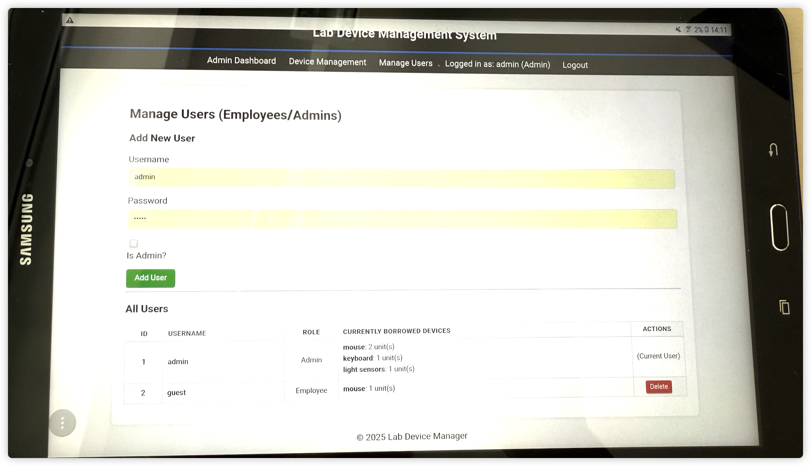

# Lab Device Management System

The Lab Device Management System centralizes laboratory equipment tracking for academic and research settings. It offers administrators minimal inventory control and enables staff/students to borrow and return devices with basic tracking.

Why not use Google Sheets or Excel? If we track who borrowed what, we need to build another software based on these tools. We just do not want to stack these tools on top of each other. This solution can also be extended or modified to fit specific needs, making it a flexible choice for device management.

## Screenshots

<details>
<summary>Click to view screenshots</summary>





</details>

## Key Features

### For Admin

- **Device Management**: create, add, borrow, return, and delete devices
- **User Management**: Create and manage employee and admin accounts, see borrowing history

### For Employee/Student
- **Device Management**: add, borrow, and return devices
- **Borrowing History**: View personal borrowing history


## Technology Stack

- **Backend**: Flask (Python web framework)
- **Database**: SQLite with SQLAlchemy ORM
- **Authentication**: Flask-Login for session management
- **Frontend**: Jinja2 templates with responsive CSS
- **Security**: Werkzeug password hashing


## Installation & Deployment

### Prerequisites

- Python 3.7 or higher
- pip (Python package installer)

### Quick Start (Development)

1. **Clone or download the project**
   ```bash
   git clone <repository-url>
   cd lab_device_manager
   ```

2. **Create a virtual environment and install dependancies**
   ```bash
   python -m venv venv
   source venv/bin/activate
   pip install -r requirements.txt
   ```

3. **Run the application** use tmux or screen to keep it running in the background if you are deploying it
   ```bash
   flask create-db  # Create the database
   flask create-admin  # Create an admin user.
   flask run --host=0.0.0.0 --port=5001 # run on localhost:5001, change port if needed
   ```

4. **Access the application**
   - Open your web browser and go to: `http://HOST_NAME:5000`
   - Default admin credentials: (change the hardcoded credentials in `app.py` for production)
     - Username: `admin`
     - Password: `admin`

## System Architecture

### Database Schema

**Users Table**
- id, username, password_hash, is_admin

**Devices Table**
- id, name, quantity, notes

**BorrowLog Table**
- id, user_id, device_id, quantity_transacted, transaction_type, transaction_date

### Transaction Types
- `borrow`: User borrows devices (decreases inventory)
- `return`: User returns devices (increases inventory)
- `add_stock`: Adding new inventory (increases inventory)

## Troubleshooting

1. **Port already in use**: Change port in `app.py` or kill existing process
2. **Database errors**: Delete `devices.db` file to reset database
3. **Permission errors**: Ensure proper file permissions in deployment directory
4. **Missing dependencies**: Run `pip install -r requirements.txt` again or install missing packages manually

## License

MIT License (MIT)
